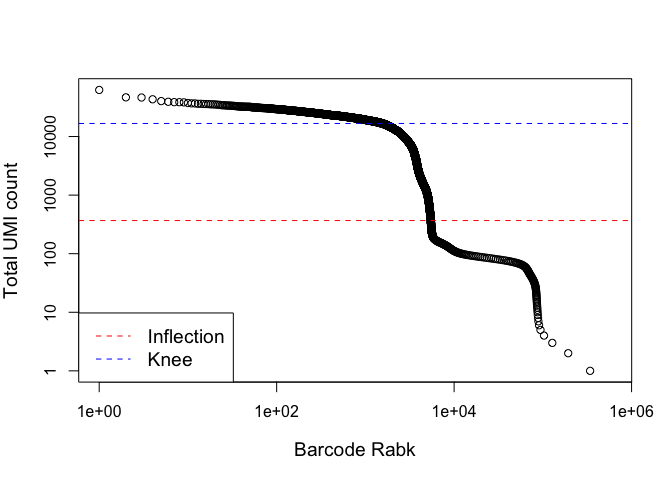

## R Markdown


```r
## -- reading in the 10x data  -- ##

library(BiocFileCache)
```

```
## Loading required package: dbplyr
```

```r
bfc <- BiocFileCache("./raw_data", ask = FALSE)
guiu.zip <- bfcrpath(bfc, 
                    file.path("https://www.ebi.ac.uk/arrayexpress/files",
                              "E-MTAB-7660/E-MTAB-7660.processed.1.zip"))
unzip(guiu.zip, exdir = "./raw_data")
tarPath <- file.path("./raw_data/guiu2019_10xProcessed.tar.gz")
untar(tarPath,exdir = "./raw_data")
```

## Including Plots


```r
library(DropletUtils)
library(Matrix)
files <- file.path(getwd(), "./raw_data/guiu2019_10xProcessed/raw_gene_bc_matrices/mm10")
sce.guiu <- read10xCounts(files, col.names=TRUE)
sce.guiu
```

```
## class: SingleCellExperiment 
## dim: 27998 737280 
## metadata(1): Samples
## assays(1): counts
## rownames(27998): ENSMUSG00000051951 ENSMUSG00000089699 ...
##   ENSMUSG00000096730 ENSMUSG00000095742
## rowData names(2): ID Symbol
## colnames(737280): AAACCTGAGAAACCAT-1 AAACCTGAGAAACCGC-1 ...
##   TTTGTCATCTTTAGTC-1 TTTGTCATCTTTCCTC-1
## colData names(2): Sample Barcode
## reducedDimNames(0):
## spikeNames(0):
## altExpNames(0):
```


```r
# do some exploring of this sce 
dim(sce.guiu)
```

```
## [1]  27998 737280
```

```r
assays(sce.guiu)
```

```
## List of length 1
## names(1): counts
```

```r
head(rownames(sce.guiu))# confirmed annotation with Ensembl notation
```

```
## [1] "ENSMUSG00000051951" "ENSMUSG00000089699" "ENSMUSG00000102343"
## [4] "ENSMUSG00000025900" "ENSMUSG00000109048" "ENSMUSG00000025902"
```

```r
head(rowData(sce.guiu)) # annotated with gene ID and gene Symbol
```

```
## DataFrame with 6 rows and 2 columns
##                                    ID      Symbol
##                           <character> <character>
## ENSMUSG00000051951 ENSMUSG00000051951        Xkr4
## ENSMUSG00000089699 ENSMUSG00000089699      Gm1992
## ENSMUSG00000102343 ENSMUSG00000102343     Gm37381
## ENSMUSG00000025900 ENSMUSG00000025900         Rp1
## ENSMUSG00000109048 ENSMUSG00000109048         Rp1
## ENSMUSG00000025902 ENSMUSG00000025902       Sox17
```

```r
names(colData(sce.guiu)) # sample names and cell barcode
```

```
## [1] "Sample"  "Barcode"
```

```r
table(grepl("^ERCC", rownames(sce.guiu))) # there are no ERCC spike ins
```

```
## 
## FALSE 
## 27998
```

```r
table(grepl("^SIRV", rownames(sce.guiu))) # there are no SIRV spike ins
```

```
## 
## FALSE 
## 27998
```


```r
## -- quality control by removing empty droplets-- ##

barcodeRank <- barcodeRanks(counts(sce.guiu))
# Only showing unique points for plotting speed.
uniqBc <- !duplicated(barcodeRank$rank)
plot(barcodeRank$rank[uniqBc], barcodeRank$total[uniqBc], log="xy",
     xlab="Barcode Rabk", ylab="Total UMI count", cex.lab=1.2)
```

```
## Warning in xy.coords(x, y, xlabel, ylabel, log): 1 y value <= 0 omitted from
## logarithmic plot
```

```r
abline(h=metadata(barcodeRank)$inflection, col="red", lty=2)
abline(h=metadata(barcodeRank)$knee, col="blue", lty=2)

legend("bottomleft", legend=c("Inflection", "Knee"), 
       col=c("red", "blue"), lty=2, cex=1.2)
```

<!-- -->


```r
# use emptyDrops function to remove empty drops (uses monte carlo sim so have to set.seed)
set.seed(101)

# calculates pValues to determine cell from drops with FDR 0.001
e.out <- emptyDrops(counts(sce.guiu))
summary(e.out$FDR <= 0.001)
```

```
##    Mode   FALSE    TRUE    NA's 
## logical    6639    5289  725352
```

```r
# subset the sce based on the columns which pass our FDR cutoff of 0.1%
sce.guiu <- sce.guiu[,which(e.out$FDR <= 0.001)]
dim(sce.guiu) # now there are only 5289 cells remaining
```

```
## [1] 27998  5289
```


```r
unfiltered <- sce.guiu # save the sce post removing empty's but before additional QC
```

