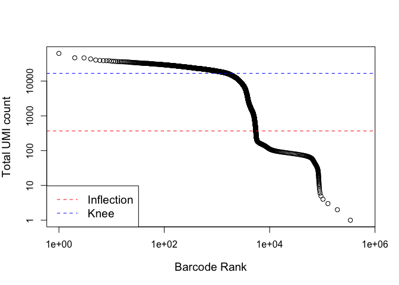

Reading in the data and removing empty droplets
================

Overview
--------

An exploratory analysis of public single-cell RNA-seq data from \[Guiu et al\] <https://www.nature.com/articles/s41586-019-1212-5#Sec2> and retrieved from the Single Cell Expression Atlas

Dependencies
------------

Load the major packages needed for this analysis first. Additional packages will be loaded as needed.

``` r
# dependencies needed
library(SingleCellExperiment)
library(scater)
library(scran)
library(uwot)
library(Rtsne)
```

Obtain in the data from ArrayExpress
------------------------------------

``` r
## -- download and unzip data  -- ##

library(BiocFileCache)
```

    ## Loading required package: dbplyr

``` r
bfc <- BiocFileCache("./raw_data", ask = FALSE)
guiu.zip <- bfcrpath(bfc, 
                    file.path("https://www.ebi.ac.uk/arrayexpress/files",
                              "E-MTAB-7660/E-MTAB-7660.processed.1.zip"))
unzip(guiu.zip, exdir = "./raw_data")
tarPath <- file.path("./raw_data/guiu2019_10xProcessed.tar.gz")
untar(tarPath,exdir = "./raw_data")
```

Read the 10x data into a SingleCellExperiment container
-------------------------------------------------------

Using a dedicated function for data collected from 10X Genomics Chromiun platform, read the raw files into R as a SingleCellExperiment (sce). Take a look at the sce to see what's in there.

``` r
## -- reading in the 10x data  -- ##

library(DropletUtils)
library(Matrix)
files <- file.path(getwd(), "./raw_data/guiu2019_10xProcessed/raw_gene_bc_matrices/mm10")
sce.guiu <- read10xCounts(files, col.names=TRUE)
sce.guiu
```

    ## class: SingleCellExperiment 
    ## dim: 27998 737280 
    ## metadata(1): Samples
    ## assays(1): counts
    ## rownames(27998): ENSMUSG00000051951 ENSMUSG00000089699 ...
    ##   ENSMUSG00000096730 ENSMUSG00000095742
    ## rowData names(2): ID Symbol
    ## colnames(737280): AAACCTGAGAAACCAT-1 AAACCTGAGAAACCGC-1 ...
    ##   TTTGTCATCTTTAGTC-1 TTTGTCATCTTTCCTC-1
    ## colData names(2): Sample Barcode
    ## reducedDimNames(0):
    ## spikeNames(0):
    ## altExpNames(0):

Additional exploration of the sce.

1.  How many droplets are present?

2.  How are the genes annotated?

3.  Are there spike in transcripts?

``` r
# do some exploring of this sce 
dim(sce.guiu) # how many rows and columns
```

    ## [1]  27998 737280

``` r
assays(sce.guiu) # what assays are present
```

    ## List of length 1
    ## names(1): counts

``` r
head(rownames(sce.guiu))# confirmed annotation with Ensembl notation
```

    ## [1] "ENSMUSG00000051951" "ENSMUSG00000089699" "ENSMUSG00000102343"
    ## [4] "ENSMUSG00000025900" "ENSMUSG00000109048" "ENSMUSG00000025902"

``` r
head(rowData(sce.guiu)) # annotated with gene ID and gene Symbol
```

    ## DataFrame with 6 rows and 2 columns
    ##                                    ID      Symbol
    ##                           <character> <character>
    ## ENSMUSG00000051951 ENSMUSG00000051951        Xkr4
    ## ENSMUSG00000089699 ENSMUSG00000089699      Gm1992
    ## ENSMUSG00000102343 ENSMUSG00000102343     Gm37381
    ## ENSMUSG00000025900 ENSMUSG00000025900         Rp1
    ## ENSMUSG00000109048 ENSMUSG00000109048         Rp1
    ## ENSMUSG00000025902 ENSMUSG00000025902       Sox17

``` r
names(colData(sce.guiu)) # sample names and cell barcode
```

    ## [1] "Sample"  "Barcode"

``` r
table(grepl("^ERCC", rownames(sce.guiu))) # there are no ERCC spike ins
```

    ## 
    ## FALSE 
    ## 27998

``` r
table(grepl("^SIRV", rownames(sce.guiu))) # there are no SIRV spike ins
```

    ## 
    ## FALSE 
    ## 27998

Removing empty droplets
-----------------------

First plot the UMI's per barcode by barcode rank. Allows us to determine "knee" and "inflection point" in the curve. Beyond the inflection point, there is a sharp decline in UMI's per barcode.

``` r
# -- compare barcode rank to total UMI count  -- #

barcodeRank <- barcodeRanks(counts(sce.guiu))
# Only showing unique points to speed up the plotting.

uniqBc <- !duplicated(barcodeRank$rank)
plot(barcodeRank$rank[uniqBc], barcodeRank$total[uniqBc], log="xy",
     xlab="Barcode Rank", ylab="Total UMI count", cex.lab=1.2)
```

    ## Warning in xy.coords(x, y, xlabel, ylabel, log): 1 y value <= 0 omitted from
    ## logarithmic plot

``` r
abline(h=metadata(barcodeRank)$inflection, col="red", lty=2)
abline(h=metadata(barcodeRank)$knee, col="blue", lty=2)
legend("bottomleft", legend=c("Inflection", "Knee"), 
       col=c("red", "blue"), lty=2, cex=1.2)
```



Next use the emptyDrops function to test whether each barcode expression profile is significantly different from the pool of ambient RNA in flowcell.Compute p-values and apply an FDR threshold to retain cells and remove empty drops.

``` r
# use emptyDrops function to remove empty drops (uses monte carlo sim so have to set.seed)
set.seed(101)

# calculates pValues to determine cells from empty drops with FDR 0.001
e.out <- emptyDrops(counts(sce.guiu))
summary(e.out$FDR <= 0.001)
```

    ##    Mode   FALSE    TRUE    NA's 
    ## logical    6639    5289  725352

``` r
# subset the sce based on the columns which pass our FDR cutoff of 0.1%
sce.guiu <- sce.guiu[,which(e.out$FDR <= 0.001)]
dim(sce.guiu) # now there are only 5289 cells remaining
```

    ## [1] 27998  5289

Output
------

After removing empty drops, output the resulting sce as unfiltered and save the file to the processed\_data folder

``` r
unfiltered <- sce.guiu # save the sce post removing empty's but before additional QC
saveRDS(unfiltered, file="./processed_data/guiu_unfiltered.rds")
```
