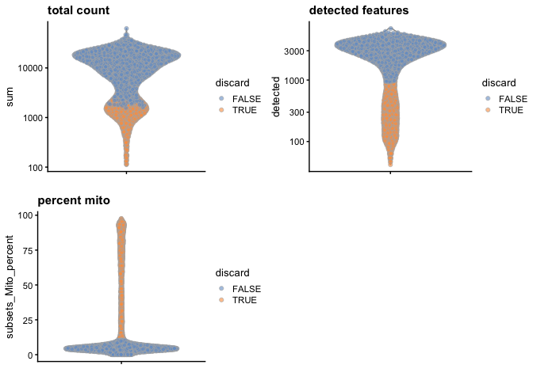
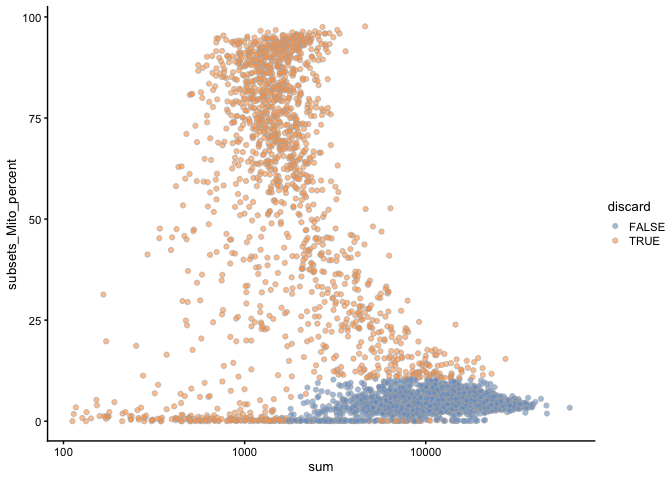

Quality Control and Filtering
================

Dependencies
------------

Load the major packages needed for this analysis first. Additional packages will be loaded as needed.

``` r
# dependencies needed
library(SingleCellExperiment)
```

    ## Loading required package: SummarizedExperiment

    ## Loading required package: GenomicRanges

    ## Loading required package: stats4

    ## Loading required package: BiocGenerics

    ## Loading required package: parallel

    ## 
    ## Attaching package: 'BiocGenerics'

    ## The following objects are masked from 'package:parallel':
    ## 
    ##     clusterApply, clusterApplyLB, clusterCall, clusterEvalQ,
    ##     clusterExport, clusterMap, parApply, parCapply, parLapply,
    ##     parLapplyLB, parRapply, parSapply, parSapplyLB

    ## The following objects are masked from 'package:stats':
    ## 
    ##     IQR, mad, sd, var, xtabs

    ## The following objects are masked from 'package:base':
    ## 
    ##     anyDuplicated, append, as.data.frame, basename, cbind, colnames,
    ##     dirname, do.call, duplicated, eval, evalq, Filter, Find, get, grep,
    ##     grepl, intersect, is.unsorted, lapply, Map, mapply, match, mget,
    ##     order, paste, pmax, pmax.int, pmin, pmin.int, Position, rank,
    ##     rbind, Reduce, rownames, sapply, setdiff, sort, table, tapply,
    ##     union, unique, unsplit, which, which.max, which.min

    ## Loading required package: S4Vectors

    ## 
    ## Attaching package: 'S4Vectors'

    ## The following object is masked from 'package:base':
    ## 
    ##     expand.grid

    ## Loading required package: IRanges

    ## Loading required package: GenomeInfoDb

    ## Loading required package: Biobase

    ## Welcome to Bioconductor
    ## 
    ##     Vignettes contain introductory material; view with
    ##     'browseVignettes()'. To cite Bioconductor, see
    ##     'citation("Biobase")', and for packages 'citation("pkgname")'.

    ## Loading required package: DelayedArray

    ## Loading required package: matrixStats

    ## 
    ## Attaching package: 'matrixStats'

    ## The following objects are masked from 'package:Biobase':
    ## 
    ##     anyMissing, rowMedians

    ## Loading required package: BiocParallel

    ## 
    ## Attaching package: 'DelayedArray'

    ## The following objects are masked from 'package:matrixStats':
    ## 
    ##     colMaxs, colMins, colRanges, rowMaxs, rowMins, rowRanges

    ## The following objects are masked from 'package:base':
    ## 
    ##     aperm, apply, rowsum

``` r
library(scater)
```

    ## Loading required package: ggplot2

``` r
library(scran)
library(uwot)
```

    ## Loading required package: Matrix

    ## 
    ## Attaching package: 'Matrix'

    ## The following object is masked from 'package:S4Vectors':
    ## 
    ##     expand

``` r
library(Rtsne)
```

Importing Mouse Genome Annotation
---------------------------------

``` r
library(AnnotationHub) # load the ensembldb
```

    ## Loading required package: BiocFileCache

    ## Loading required package: dbplyr

    ## 
    ## Attaching package: 'AnnotationHub'

    ## The following object is masked from 'package:Biobase':
    ## 
    ##     cache

``` r
ah = AnnotationHub() # create annotation hub object
```

    ## snapshotDate(): 2019-10-29

``` r
#search for and then load emsembl db v98 for mouse
dbNumber<-names(query(ah, c('Ensembl', 'musculus', 'EnsDb', '98')))
eDb<-ah[[dbNumber]] 
```

    ## loading from cache

    ## require("ensembldb")

``` r
keytypes(eDb) # remind me what keys are availble to select records with
```

    ##  [1] "ENTREZID"            "EXONID"              "GENEBIOTYPE"        
    ##  [4] "GENEID"              "GENENAME"            "PROTDOMID"          
    ##  [7] "PROTEINDOMAINID"     "PROTEINDOMAINSOURCE" "PROTEINID"          
    ## [10] "SEQNAME"             "SEQSTRAND"           "SYMBOL"             
    ## [13] "TXBIOTYPE"           "TXID"                "TXNAME"             
    ## [16] "UNIPROTID"

``` r
columns(eDb)
```

    ##  [1] "DESCRIPTION"         "ENTREZID"            "EXONID"             
    ##  [4] "EXONIDX"             "EXONSEQEND"          "EXONSEQSTART"       
    ##  [7] "GCCONTENT"           "GENEBIOTYPE"         "GENEID"             
    ## [10] "GENEIDVERSION"       "GENENAME"            "GENESEQEND"         
    ## [13] "GENESEQSTART"        "INTERPROACCESSION"   "ISCIRCULAR"         
    ## [16] "PROTDOMEND"          "PROTDOMSTART"        "PROTEINDOMAINID"    
    ## [19] "PROTEINDOMAINSOURCE" "PROTEINID"           "PROTEINSEQUENCE"    
    ## [22] "SEQCOORDSYSTEM"      "SEQLENGTH"           "SEQNAME"            
    ## [25] "SEQSTRAND"           "SYMBOL"              "TXBIOTYPE"          
    ## [28] "TXCDSSEQEND"         "TXCDSSEQSTART"       "TXID"               
    ## [31] "TXIDVERSION"         "TXNAME"              "TXSEQEND"           
    ## [34] "TXSEQSTART"          "TXSUPPORTLEVEL"      "UNIPROTDB"          
    ## [37] "UNIPROTID"           "UNIPROTMAPPINGTYPE"

``` r
unfiltered <- readRDS(file="./processed_data/guiu_unfiltered.rds")
```

``` r
## Goal - to retrieve the chromosome location of each gene in sce.guiu to see if it is mtDNA
chrom<-mapIds(eDb, keys = rowData(unfiltered)$ID, column = "SEQNAME", keytype = "GENEID")
```

    ## Warning: Unable to map 558 of 27998 requested IDs.

``` r
# genes belonging to mtDNA as determined from chrom/edb
mito<-which(chrom=="MT")
```

``` r
# Compute the QC metrics per cell
library(scater)
metrics <- perCellQCMetrics(unfiltered, subsets=list(Mito=mito))
head(metrics)
```

    ## DataFrame with 6 rows and 10 columns
    ##         sum  detected   percent_top_50  percent_top_100  percent_top_200
    ##   <numeric> <integer>        <numeric>        <numeric>        <numeric>
    ## 1      8007      2463 36.3806669164481 46.1346321968278 56.2882477831897
    ## 2      6343      2207 25.5399653160965 39.3189342582374 52.3569288979978
    ## 3     35857      5178 24.0985023844717 37.8531388571269 51.2229132386982
    ## 4     21726      4165 24.4269538801436 38.5436803829513 51.8319064715088
    ## 5     11009      2970 26.2966663638841 40.2579707512036 53.9831047324916
    ## 6      6885      2337 23.7472766884532 35.5410312273057 49.6296296296296
    ##    percent_top_500 subsets_Mito_sum subsets_Mito_detected subsets_Mito_percent
    ##          <numeric>        <numeric>             <integer>            <numeric>
    ## 1 70.4008992131885             1763                    12     22.0182340452104
    ## 2 68.0908087655683              322                    11      5.0764622418414
    ## 3 65.8169952868338             1267                    11     3.53348021306858
    ## 4 66.7357083678542              710                    11     3.26797385620915
    ## 5 68.3804160232537              422                    11     3.83322735943319
    ## 6 66.5504720406681              360                    12     5.22875816993464
    ##       total
    ##   <numeric>
    ## 1      8007
    ## 2      6343
    ## 3     35857
    ## 4     21726
    ## 5     11009
    ## 6      6885

``` r
metrics.lib <- isOutlier(metrics$sum, log=TRUE, nmads = 2, type="lower")
attr(metrics.lib, "thresholds")
```

    ##    lower   higher 
    ## 1484.771      Inf

``` r
metrics.exprs <- isOutlier(metrics$detected, log=TRUE, nmads = 2,type="lower")
attr(metrics.exprs, "thresholds")
```

    ##    lower   higher 
    ## 937.7957      Inf

``` r
metrics.mito <- isOutlier(metrics$subsets_Mito_percent,nmads = 2, type="higher")
attr(metrics.mito, "thresholds")
```

    ##    lower   higher 
    ##     -Inf 10.48488

``` r
discard <- metrics.lib | metrics.exprs | metrics.mito
```

``` r
# Summarize the number of cells removed by which reason.
DataFrame(libSize=sum(metrics.lib), exprs=sum(metrics.exprs),
           mitoPercent=sum(metrics.mito), total=sum(discard))
```

    ## DataFrame with 1 row and 4 columns
    ##     libSize     exprs mitoPercent     total
    ##   <integer> <integer>   <integer> <integer>
    ## 1       758      1335        1411      1640

``` r
# column bind the states from perCellQC to the original sce now called unfiltered
colData(unfiltered) <- cbind(colData(unfiltered), metrics)
# add a new column called discard that includes the logical for metrics.mito
unfiltered$discard <- discard
```

``` r
# take a look at what the filtering did with plots colored by discard identity
gridExtra::grid.arrange(
  plotColData(unfiltered, y="sum", colour_by="discard") +
    scale_y_log10() + ggtitle("total count"),
  plotColData(unfiltered, y="detected", colour_by="discard") +
    scale_y_log10() + ggtitle("detected features"),
  plotColData(unfiltered, y="subsets_Mito_percent",
    colour_by="discard") + ggtitle("percent mito"),
  ncol=2
)
```



``` r
#compare filtering metrics to each other
plotColData(unfiltered, x="sum", y="detected",
            colour_by="discard") + scale_x_log10()
```


``` r
plotColData(unfiltered, x="sum", y="subsets_Mito_percent",
            colour_by="discard") + scale_x_log10()
```



``` r
# Keeping the columns we DON'T want to discard.
filtered <- unfiltered[,!discard]
dim(unfiltered) # more cells
```

    ## [1] 27998  5289

``` r
dim(filtered) # less cells!
```

    ## [1] 27998  3649

``` r
saveRDS(filtered, file="./processed_data/guiu_unfiltered.rds") # save the sce post QC
```
