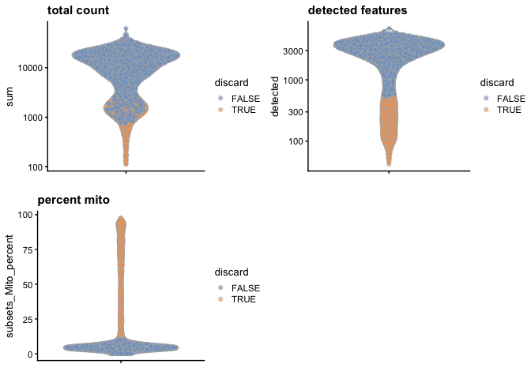
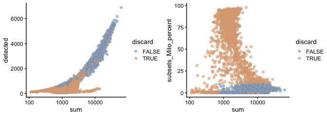

Quality Control and Filtering
================

Dependencies
------------

Load the major packages needed for this analysis first. Additional packages will be loaded as needed.

``` r
# dependencies needed
library(SingleCellExperiment)
library(scater)
library(scran)
library(uwot)
library(Rtsne)
```

Loading the unfiltered file which was output by "1\_readData\_countCells.Rmd"

``` r
unfiltered <- readRDS(file="../processed_data/guiu_unfiltered.rds")
```

Importing Mouse Genome Annotation
---------------------------------

Need to import the annotation database to determine the chromsome location of genes in the mouse genome in order to annotate genes which are mitochondrial in origin

``` r
library(AnnotationHub) 
ah = AnnotationHub() # create annotation hub object
```

Now query annotation hub for the Ensemnl mouse annotation database version 98 and then load it.

``` r
#search for and then load emsembl db v98 for mouse
dbNumber<-names(query(ah, c('Ensembl', 'musculus', 'EnsDb', '98')))
eDb<-ah[[dbNumber]] 
```

    ## loading from cache

    ## require("ensembldb")

``` r
keytypes(eDb) # remind me what keys are availble to select records with
```

    ##  [1] "ENTREZID"            "EXONID"              "GENEBIOTYPE"        
    ##  [4] "GENEID"              "GENENAME"            "PROTDOMID"          
    ##  [7] "PROTEINDOMAINID"     "PROTEINDOMAINSOURCE" "PROTEINID"          
    ## [10] "SEQNAME"             "SEQSTRAND"           "SYMBOL"             
    ## [13] "TXBIOTYPE"           "TXID"                "TXNAME"             
    ## [16] "UNIPROTID"

``` r
columns(eDb)
```

    ##  [1] "DESCRIPTION"         "ENTREZID"            "EXONID"             
    ##  [4] "EXONIDX"             "EXONSEQEND"          "EXONSEQSTART"       
    ##  [7] "GCCONTENT"           "GENEBIOTYPE"         "GENEID"             
    ## [10] "GENEIDVERSION"       "GENENAME"            "GENESEQEND"         
    ## [13] "GENESEQSTART"        "INTERPROACCESSION"   "ISCIRCULAR"         
    ## [16] "PROTDOMEND"          "PROTDOMSTART"        "PROTEINDOMAINID"    
    ## [19] "PROTEINDOMAINSOURCE" "PROTEINID"           "PROTEINSEQUENCE"    
    ## [22] "SEQCOORDSYSTEM"      "SEQLENGTH"           "SEQNAME"            
    ## [25] "SEQSTRAND"           "SYMBOL"              "TXBIOTYPE"          
    ## [28] "TXCDSSEQEND"         "TXCDSSEQSTART"       "TXID"               
    ## [31] "TXIDVERSION"         "TXNAME"              "TXSEQEND"           
    ## [34] "TXSEQSTART"          "TXSUPPORTLEVEL"      "UNIPROTDB"          
    ## [37] "UNIPROTID"           "UNIPROTMAPPINGTYPE"

Annotating mitochondiral genes
------------------------------

Determine the chromosome location of each gene found in the 'unfiltered' sce and make a list of genes that are found on the mtDNA

``` r
## Goal - to retrieve the chromosome location of each gene in sce.guiu to see if it is mtDNA
chrom<-mapIds(eDb, keys = rowData(unfiltered)$ID, column = "SEQNAME", keytype = "GENEID")
# genes belonging to mtDNA as determined from chrom/edb
mito<-which(chrom=="MT")
```

Computing quality control metrics and calling outliers
------------------------------------------------------

Using functions from the package scater, determine the quality control metrics for the unfiltred data - including total count's per cell, number of genes detected per cell, and the percentage of reads which aligned to mitochrondial genes.

``` r
# Compute the QC metrics per cell
metrics <- perCellQCMetrics(unfiltered, subsets=list(Mito=mito))
head(metrics)
```

    ## DataFrame with 6 rows and 10 columns
    ##         sum  detected   percent_top_50  percent_top_100  percent_top_200
    ##   <numeric> <integer>        <numeric>        <numeric>        <numeric>
    ## 1      8007      2463 36.3806669164481 46.1346321968278 56.2882477831897
    ## 2      6343      2207 25.5399653160965 39.3189342582374 52.3569288979978
    ## 3     35857      5178 24.0985023844717 37.8531388571269 51.2229132386982
    ## 4     21726      4165 24.4269538801436 38.5436803829513 51.8319064715088
    ## 5     11009      2970 26.2966663638841 40.2579707512036 53.9831047324916
    ## 6      6885      2337 23.7472766884532 35.5410312273057 49.6296296296296
    ##    percent_top_500 subsets_Mito_sum subsets_Mito_detected subsets_Mito_percent
    ##          <numeric>        <numeric>             <integer>            <numeric>
    ## 1 70.4008992131885             1763                    12     22.0182340452104
    ## 2 68.0908087655683              322                    11      5.0764622418414
    ## 3 65.8169952868338             1267                    11     3.53348021306858
    ## 4 66.7357083678542              710                    11     3.26797385620915
    ## 5 68.3804160232537              422                    11     3.83322735943319
    ## 6 66.5504720406681              360                    12     5.22875816993464
    ##       total
    ##   <numeric>
    ## 1      8007
    ## 2      6343
    ## 3     35857
    ## 4     21726
    ## 5     11009
    ## 6      6885

Determine outlier cells based on median absolute deviation from the mean and combine into a logical, discard.

``` r
# Cell library size
rm.lib <- isOutlier(metrics$sum, log=TRUE, nmads = 3, type="lower")
attr(rm.lib, "thresholds") # output the threshold
```

    ##    lower   higher 
    ## 562.3659      Inf

``` r
# Number of genes detected
rm.exprs <- isOutlier(metrics$detected, log=TRUE, nmads = 3,type="lower")
attr(rm.exprs, "thresholds") # output the threshold
```

    ##    lower   higher 
    ## 539.3688      Inf

``` r
# percent mtDNA transcripts
rm.mito <- isOutlier(metrics$subsets_Mito_percent,nmads = 2, type="higher")
attr(rm.mito, "thresholds") # output the threshold
```

    ##    lower   higher 
    ##     -Inf 10.48488

``` r
# combine into one logical
discard <- rm.lib | rm.exprs | rm.mito
```

Summarize the number of cells removed based on which reason.

``` r
DataFrame(libSize=sum(rm.lib), exprs=sum(rm.exprs),
           mitoPercent=sum(rm.mito), total=sum(discard))
```

    ## DataFrame with 1 row and 4 columns
    ##     libSize     exprs mitoPercent     total
    ##   <integer> <integer>   <integer> <integer>
    ## 1       116      1101        1411      1554

Now add back the calculated QC metrics to the SingleCellExperiement via the colData slot and a new column for the discard logical

``` r
# column bind the states from perCellQC to the original sce now called unfiltered
colData(unfiltered) <- cbind(colData(unfiltered), metrics)
# add a new column called discard that includes the logical for metrics.mito
unfiltered$discard <- discard
```

Examining the results of QC filtering
-------------------------------------

Next take a look at what the above filtering did via plots colored by discard identity

``` r
# Violin plots for total counts, # genes detected, and mito% colored by discard status
gridExtra::grid.arrange(
  plotColData(unfiltered, y="sum", colour_by="discard") +
    scale_y_log10() + ggtitle("total count"),
  plotColData(unfiltered, y="detected", colour_by="discard") +
    scale_y_log10() + ggtitle("detected features"),
  plotColData(unfiltered, y="subsets_Mito_percent",
    colour_by="discard") + ggtitle("percent mito"),
  ncol=2
)
```



Compare filtering metrics to each other pairwise in scatter plots colored by discard status

``` r
gridExtra::grid.arrange(
  plotColData(unfiltered, x="sum", y="detected",
            colour_by="discard") + scale_x_log10() ,
  plotColData(unfiltered, x="sum", y="subsets_Mito_percent",
            colour_by="discard") + scale_x_log10(),
 ncol=2 
)
```



Discard low quality cells
-------------------------

Output into a new sce called 'filtered' all the cells which do not meet the criteria for discard and then check that the number of cells has decreased

``` r
# keep the columns not marked for discard.
filtered <- unfiltered[,!discard]
dim(unfiltered) # more cells
```

    ## [1] 27998  5289

``` r
dim(filtered) # less cells!
```

    ## [1] 27998  3735

Save out the new sce to file

``` r
saveRDS(filtered, file="../processed_data/guiu_filtered.rds") # save the sce post QC
```

``` r
sessionInfo()
```

    ## R version 3.6.2 (2019-12-12)
    ## Platform: x86_64-apple-darwin15.6.0 (64-bit)
    ## Running under: macOS Sierra 10.12.6
    ## 
    ## Matrix products: default
    ## BLAS:   /Library/Frameworks/R.framework/Versions/3.6/Resources/lib/libRblas.0.dylib
    ## LAPACK: /Library/Frameworks/R.framework/Versions/3.6/Resources/lib/libRlapack.dylib
    ## 
    ## locale:
    ## [1] en_US.UTF-8/en_US.UTF-8/en_US.UTF-8/C/en_US.UTF-8/en_US.UTF-8
    ## 
    ## attached base packages:
    ## [1] parallel  stats4    stats     graphics  grDevices utils     datasets 
    ## [8] methods   base     
    ## 
    ## other attached packages:
    ##  [1] ensembldb_2.10.2            AnnotationFilter_1.10.0    
    ##  [3] GenomicFeatures_1.38.0      AnnotationDbi_1.48.0       
    ##  [5] AnnotationHub_2.18.0        BiocFileCache_1.10.2       
    ##  [7] dbplyr_1.4.2                Rtsne_0.15                 
    ##  [9] uwot_0.1.5                  Matrix_1.2-18              
    ## [11] scran_1.14.5                scater_1.14.6              
    ## [13] ggplot2_3.2.1               SingleCellExperiment_1.8.0 
    ## [15] SummarizedExperiment_1.16.1 DelayedArray_0.12.2        
    ## [17] BiocParallel_1.20.1         matrixStats_0.55.0         
    ## [19] Biobase_2.46.0              GenomicRanges_1.38.0       
    ## [21] GenomeInfoDb_1.22.0         IRanges_2.20.2             
    ## [23] S4Vectors_0.24.2            BiocGenerics_0.32.0        
    ## 
    ## loaded via a namespace (and not attached):
    ##  [1] ggbeeswarm_0.6.0              colorspace_1.4-1             
    ##  [3] XVector_0.26.0                BiocNeighbors_1.4.1          
    ##  [5] farver_2.0.1                  bit64_0.9-7                  
    ##  [7] interactiveDisplayBase_1.24.0 knitr_1.26                   
    ##  [9] zeallot_0.1.0                 Rsamtools_2.2.1              
    ## [11] shiny_1.4.0                   BiocManager_1.30.10          
    ## [13] compiler_3.6.2                httr_1.4.1                   
    ## [15] dqrng_0.2.1                   backports_1.1.5              
    ## [17] assertthat_0.2.1              fastmap_1.0.1                
    ## [19] lazyeval_0.2.2                limma_3.42.0                 
    ## [21] later_1.0.0                   BiocSingular_1.2.1           
    ## [23] htmltools_0.4.0               prettyunits_1.1.0            
    ## [25] tools_3.6.2                   rsvd_1.0.2                   
    ## [27] igraph_1.2.4.2                gtable_0.3.0                 
    ## [29] glue_1.3.1                    GenomeInfoDbData_1.2.2       
    ## [31] dplyr_0.8.3                   rappdirs_0.3.1               
    ## [33] Rcpp_1.0.3                    vctrs_0.2.1                  
    ## [35] Biostrings_2.54.0             rtracklayer_1.46.0           
    ## [37] DelayedMatrixStats_1.8.0      xfun_0.12                    
    ## [39] stringr_1.4.0                 mime_0.8                     
    ## [41] lifecycle_0.1.0               irlba_2.3.3                  
    ## [43] statmod_1.4.33                XML_3.98-1.20                
    ## [45] edgeR_3.28.0                  zlibbioc_1.32.0              
    ## [47] scales_1.1.0                  ProtGenerics_1.18.0          
    ## [49] hms_0.5.3                     promises_1.1.0               
    ## [51] yaml_2.2.0                    curl_4.3                     
    ## [53] memoise_1.1.0                 gridExtra_2.3                
    ## [55] biomaRt_2.42.0                stringi_1.4.5                
    ## [57] RSQLite_2.2.0                 BiocVersion_3.10.1           
    ## [59] rlang_0.4.2                   pkgconfig_2.0.3              
    ## [61] bitops_1.0-6                  evaluate_0.14                
    ## [63] lattice_0.20-38               purrr_0.3.3                  
    ## [65] labeling_0.3                  GenomicAlignments_1.22.1     
    ## [67] cowplot_1.0.0                 bit_1.1-14                   
    ## [69] tidyselect_0.2.5              magrittr_1.5                 
    ## [71] R6_2.4.1                      DBI_1.1.0                    
    ## [73] pillar_1.4.3                  withr_2.1.2                  
    ## [75] RCurl_1.95-4.12               tibble_2.1.3                 
    ## [77] crayon_1.3.4                  rmarkdown_2.0                
    ## [79] viridis_0.5.1                 progress_1.2.2               
    ## [81] locfit_1.5-9.1                grid_3.6.2                   
    ## [83] blob_1.2.0                    digest_0.6.23                
    ## [85] xtable_1.8-4                  httpuv_1.5.2                 
    ## [87] openssl_1.4.1                 RcppParallel_4.4.4           
    ## [89] munsell_0.5.0                 beeswarm_0.2.3               
    ## [91] viridisLite_0.3.0             vipor_0.4.5                  
    ## [93] askpass_1.1
