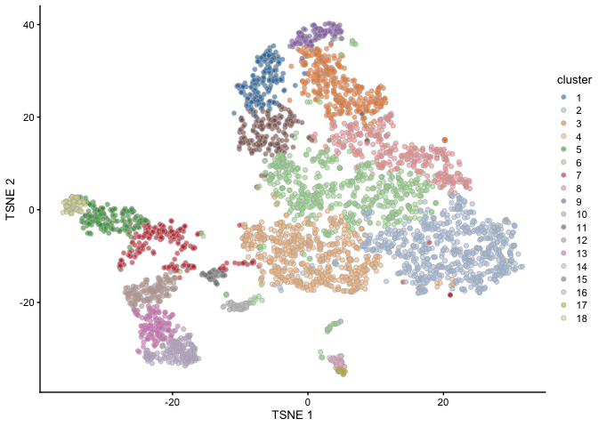

Dimensionality Reduction and Plotting
================

Dependencies
------------

Load the major packages needed for this analysis first. Additional packages will be loaded as needed.

``` r
# dependencies needed
library(SingleCellExperiment)
library(scater)
library(scran)
library(uwot)
library(Rtsne)
```

Loading the files which were output by "3\_Normalization.Rmd"

``` r
filtered<-readRDS( file="../processed_data/guiu_filtered_normalized.rds")
filtered.var<-readRDS(file="../processed_data/filtered.var.rds")
top.genes.varFDR<-readRDS( file="../processed_data/top.genes.varFDR.rds") 
```

Dimensionality Reduction by PCA and t-SNE
-----------------------------------------

First perform dimension reduction by Principal Components Analysis. Choose the number of PC's to retain until the percentage of variance explained reaches the sum of the biological component obtained by variance modelling in "3\_Normalization.Rmd".

``` r
# perform PCA for dimension reduction 
set.seed(101)
filtered.denoised <- denoisePCA(filtered, 
                                subset.row=top.genes.varFDR, 
                                technical=filtered.var)
# convert rownames to gene symbol
rownames(filtered.denoised)<-rowData(filtered.denoised)$Symbol
```

Using the above calcualted PC's perform further dimension reduction by t-SNE for visualization and compare various values for perplexity

``` r
# perform tSNE with various perplexity values
set.seed(100)
filtered.denoised <- runTSNE(filtered.denoised, dimred="PCA", perplexity=10)
try10 <- plotReducedDim(filtered.denoised, dimred="TSNE") + ggtitle("perplexity = 10")

set.seed(101)
filtered.denoised <- runTSNE(filtered.denoised, dimred="PCA", perplexity=30)
try30 <- plotReducedDim(filtered.denoised, dimred="TSNE") + ggtitle("perplexity = 30")

set.seed(102)
filtered.denoised <- runTSNE(filtered.denoised, dimred="PCA", perplexity=50)
try50 <- plotReducedDim(filtered.denoised, dimred="TSNE") + ggtitle("perplexity = 50")

set.seed(103)
filtered.denoised <- runTSNE(filtered.denoised, dimred="PCA", perplexity=75)
try75 <- plotReducedDim(filtered.denoised, dimred="TSNE") + ggtitle("perplexity = 75")

multiplot(try10, try30, try50, try75, cols=2)
```


Examining expression of marker genes across the population
----------------------------------------------------------

Next, will try to recapitulate some plots from the paper.  Here are t-SNE plots of epithelial cells from the proximal small intestine showing expression of intestinal stem-cell (Lgr5) and differentiation markers (Muc2, Lyz1, ChgA and Alpi.)

``` r
# will proceed with t-SNE plots using perplexity = 50
set.seed(102)
filtered.denoised <- runTSNE(filtered.denoised, dimred="PCA", perplexity=50)
try50 <- plotReducedDim(filtered.denoised, dimred="TSNE") + ggtitle("perplexity = 50")

# the markers from Guiu et al
diffMarkers<-c("Lgr5", "Muc2", "Lyz1", "Chga", "Alpi")

gridExtra::grid.arrange(
  plotReducedDim(filtered.denoised, dimred="TSNE", colour_by=diffMarkers[1]) +
    ggtitle(diffMarkers[1]),
  plotReducedDim(filtered.denoised, dimred="TSNE", colour_by=diffMarkers[2]) +
    ggtitle(diffMarkers[2]),
  plotReducedDim(filtered.denoised, dimred="TSNE", colour_by=diffMarkers[3]) +
    ggtitle(diffMarkers[3]),
  plotReducedDim(filtered.denoised, dimred="TSNE", colour_by= diffMarkers[4]) +
    ggtitle(diffMarkers[4]),
  plotReducedDim(filtered.denoised, dimred="TSNE", colour_by= diffMarkers[5]) +
    ggtitle(diffMarkers[5]),
  ncol=2
)
```


These resembled the plots from the paper figure reasonably well.

Clustering
----------

Construct a shared nearest neighbor graph with 10 nearest neighbors of each cell and the use the walktrap method to identify communities. Generate t-SNE plot colored by cluster

``` r
#build nearest neighbor graph
g <- buildSNNGraph(filtered.denoised, k=10, use.dimred = 'PCA')
# idenitfy communities/clusters
clust <- igraph::cluster_walktrap(g)$membership
#how many clusters and how many cells per each?
table(clust)
```

    ## clust
    ##   1   2   3   4   5   6   7   8   9  10  11  12  13  14  15  16  17  18 
    ## 182 641 305 531 162 546 184 305 105 141 180 122 122  41  42  42  22  62

``` r
#add cluster membership back to the sce as a factor
filtered.denoised$cluster <- factor(clust)
#color the t-SNE plot by cluster identity
plotReducedDim(filtered.denoised, dimred="TSNE", colour_by="cluster")
```



Identifying marker genes by cluster
-----------------------------------

Want to identify what genes are driving the separation between clusters so we can interpret the biological meaning behind clusters based on the functional annotation of these genes. Will use the Wilcoxon rank sum test for pairwise comparision between clusters.

``` r
markers.filtered <- findMarkers(filtered.denoised, test="wilcox",
                                filtered.denoised$cluster, 
                                direction="up")
# using cluster 10 as an example
markers_clust10<-markers.filtered[[10]]

# take a look at the transcriptional profile of top genes between cluster 10 and the rest
topGenes10 <- rownames(markers_clust10)[markers_clust10$Top <= 5]
plotHeatmap(filtered.denoised, features=topGenes10, exprs_values="logcounts", 
    zlim=5, center=TRUE, symmetric=TRUE, cluster_cols=FALSE,
    colour_columns_by="cluster", columns=order(filtered.denoised$cluster),
    show_colnames=FALSE)
```


``` r
# consider marker genes to be differentially expressed if the adjusted p-value is <= 0.001
deGenes10 <- markers_clust10$FDR <= 0.001 

# get the EntrezIDs for the genes
library(org.Mm.eg.db)
eIDs <- mapIds(org.Mm.eg.db, keys=rownames(markers_clust10), 
    column="ENTREZID", keytype="SYMBOL")

library(limma)
#test for GO over-represenation
go.out <- goana(unique(eIDs[deGenes10]), species="Mm", 
    universe=unique(eIDs))

# re-order the rows by p-value
go.out <- go.out[order(go.out$P.DE),]
# filter based on biological process ontology (BP) and number of genes per annotation
# this avoids having extremely general terms
go.filtered <- go.out[go.out$Ont=="BP" & go.out$N <= 200,]
head(go.filtered, 20) # look at the top 20 GO terms 
```

    ##                                                             Term Ont   N DE
    ## GO:0050796                       regulation of insulin secretion  BP 175 55
    ## GO:0001678                          cellular glucose homeostasis  BP 142 44
    ## GO:0010970                           transport along microtubule  BP 156 46
    ## GO:0099111                           microtubule-based transport  BP 156 46
    ## GO:0030705        cytoskeleton-dependent intracellular transport  BP 168 48
    ## GO:0046887              positive regulation of hormone secretion  BP 159 44
    ## GO:0008088                               axo-dendritic transport  BP  76 29
    ## GO:0090277      positive regulation of peptide hormone secretion  BP 115 36
    ## GO:0071322            cellular response to carbohydrate stimulus  BP 133 39
    ## GO:0032024              positive regulation of insulin secretion  BP  84 30
    ## GO:0009746                                    response to hexose  BP 167 44
    ## GO:0034284                            response to monosaccharide  BP 168 44
    ## GO:0009743                              response to carbohydrate  BP 181 46
    ## GO:0071331                  cellular response to hexose stimulus  BP 125 37
    ## GO:0071326          cellular response to monosaccharide stimulus  BP 126 37
    ## GO:0009749                                   response to glucose  BP 164 43
    ## GO:0071333                 cellular response to glucose stimulus  BP 123 36
    ## GO:0034767    positive regulation of ion transmembrane transport  BP 175 44
    ## GO:0035966           response to topologically incorrect protein  BP 131 37
    ## GO:1904064 positive regulation of cation transmembrane transport  BP 159 41
    ##                    P.DE
    ## GO:0050796 5.012332e-19
    ## GO:0001678 2.979498e-15
    ## GO:0010970 5.681728e-15
    ## GO:0099111 5.681728e-15
    ## GO:0030705 5.697417e-15
    ## GO:0046887 2.641184e-13
    ## GO:0008088 4.072846e-13
    ## GO:0090277 6.879142e-13
    ## GO:0071322 7.938148e-13
    ## GO:0032024 1.217990e-12
    ## GO:0009746 1.695768e-12
    ## GO:0034284 2.118446e-12
    ## GO:0009743 2.144542e-12
    ## GO:0071331 2.225479e-12
    ## GO:0071326 2.905631e-12
    ## GO:0009749 3.611566e-12
    ## GO:0071333 6.345280e-12
    ## GO:0034767 9.501361e-12
    ## GO:0035966 1.050958e-11
    ## GO:1904064 2.026603e-11

Exploratory cell type annotation via reference data
---------------------------------------------------

A preliminary attempt to predict cell types for cells in this experiemnt based on a mouse RNA-seq reference data set from the SingleR package. Generate t-SNE plot colored by cell-type annotation.

``` r
# load the reference data
library(SingleR)
ref <- MouseRNAseqData()    
# predict cell types from reference
pred <- SingleR(test=filtered.denoised, ref=ref, labels=ref$label.main)
# how many cell type predictions and how many cells per annotation
table(pred$labels)
```

    ## 
    ## Endothelial cells  Epithelial cells      Erythrocytes       Fibroblasts 
    ##                23               374               919                41 
    ##       Hepatocytes       Macrophages         Monocytes           Neurons 
    ##              2154                64                36               122 
    ##           T cells 
    ##                 2

``` r
#add cell-type annotation back to the sce as a factor
filtered.denoised$annotation <- factor(pred$labels)
# color the t-SNE by cell type
plotReducedDim(filtered.denoised, dimred="TSNE", colour_by="annotation")
```


Save the resulting files

``` r
saveRDS(filtered.denoised, file="../processed_data/guiu_filtered_denoised.rds") 
saveRDS(markers.filtered, file="../processed_data/markers_filtered.rds") 
```

``` r
sessionInfo()
```

    ## R version 3.6.2 (2019-12-12)
    ## Platform: x86_64-apple-darwin15.6.0 (64-bit)
    ## Running under: macOS Sierra 10.12.6
    ## 
    ## Matrix products: default
    ## BLAS:   /Library/Frameworks/R.framework/Versions/3.6/Resources/lib/libRblas.0.dylib
    ## LAPACK: /Library/Frameworks/R.framework/Versions/3.6/Resources/lib/libRlapack.dylib
    ## 
    ## locale:
    ## [1] en_US.UTF-8/en_US.UTF-8/en_US.UTF-8/C/en_US.UTF-8/en_US.UTF-8
    ## 
    ## attached base packages:
    ## [1] parallel  stats4    stats     graphics  grDevices utils     datasets 
    ## [8] methods   base     
    ## 
    ## other attached packages:
    ##  [1] SingleR_1.0.5               limma_3.42.0               
    ##  [3] org.Mm.eg.db_3.10.0         AnnotationDbi_1.48.0       
    ##  [5] Rtsne_0.15                  uwot_0.1.5                 
    ##  [7] Matrix_1.2-18               scran_1.14.5               
    ##  [9] scater_1.14.6               ggplot2_3.2.1              
    ## [11] SingleCellExperiment_1.8.0  SummarizedExperiment_1.16.1
    ## [13] DelayedArray_0.12.2         BiocParallel_1.20.1        
    ## [15] matrixStats_0.55.0          Biobase_2.46.0             
    ## [17] GenomicRanges_1.38.0        GenomeInfoDb_1.22.0        
    ## [19] IRanges_2.20.2              S4Vectors_0.24.2           
    ## [21] BiocGenerics_0.32.0        
    ## 
    ## loaded via a namespace (and not attached):
    ##  [1] bitops_1.0-6                  bit64_0.9-7                  
    ##  [3] httr_1.4.1                    RColorBrewer_1.1-2           
    ##  [5] tools_3.6.2                   backports_1.1.5              
    ##  [7] R6_2.4.1                      irlba_2.3.3                  
    ##  [9] vipor_0.4.5                   DBI_1.1.0                    
    ## [11] lazyeval_0.2.2                colorspace_1.4-1             
    ## [13] withr_2.1.2                   tidyselect_0.2.5             
    ## [15] gridExtra_2.3                 curl_4.3                     
    ## [17] bit_1.1-14                    compiler_3.6.2               
    ## [19] BiocNeighbors_1.4.1           labeling_0.3                 
    ## [21] scales_1.1.0                  rappdirs_0.3.1               
    ## [23] stringr_1.4.0                 digest_0.6.23                
    ## [25] rmarkdown_2.0                 XVector_0.26.0               
    ## [27] pkgconfig_2.0.3               htmltools_0.4.0              
    ## [29] fastmap_1.0.1                 dbplyr_1.4.2                 
    ## [31] rlang_0.4.2                   RSQLite_2.2.0                
    ## [33] shiny_1.4.0                   DelayedMatrixStats_1.8.0     
    ## [35] farver_2.0.1                  dplyr_0.8.3                  
    ## [37] RCurl_1.95-4.12               magrittr_1.5                 
    ## [39] BiocSingular_1.2.1            GO.db_3.10.0                 
    ## [41] GenomeInfoDbData_1.2.2        Rcpp_1.0.3                   
    ## [43] ggbeeswarm_0.6.0              munsell_0.5.0                
    ## [45] viridis_0.5.1                 lifecycle_0.1.0              
    ## [47] stringi_1.4.5                 yaml_2.2.0                   
    ## [49] edgeR_3.28.0                  zlibbioc_1.32.0              
    ## [51] BiocFileCache_1.10.2          AnnotationHub_2.18.0         
    ## [53] grid_3.6.2                    blob_1.2.0                   
    ## [55] promises_1.1.0                dqrng_0.2.1                  
    ## [57] ExperimentHub_1.12.0          crayon_1.3.4                 
    ## [59] lattice_0.20-38               cowplot_1.0.0                
    ## [61] locfit_1.5-9.1                zeallot_0.1.0                
    ## [63] knitr_1.26                    pillar_1.4.3                 
    ## [65] igraph_1.2.4.2                BiocVersion_3.10.1           
    ## [67] glue_1.3.1                    evaluate_0.14                
    ## [69] BiocManager_1.30.10           RcppParallel_4.4.4           
    ## [71] httpuv_1.5.2                  vctrs_0.2.1                  
    ## [73] gtable_0.3.0                  purrr_0.3.3                  
    ## [75] assertthat_0.2.1              xfun_0.12                    
    ## [77] mime_0.8                      rsvd_1.0.2                   
    ## [79] xtable_1.8-4                  later_1.0.0                  
    ## [81] viridisLite_0.3.0             tibble_2.1.3                 
    ## [83] pheatmap_1.0.12               beeswarm_0.2.3               
    ## [85] memoise_1.1.0                 statmod_1.4.33               
    ## [87] interactiveDisplayBase_1.24.0
