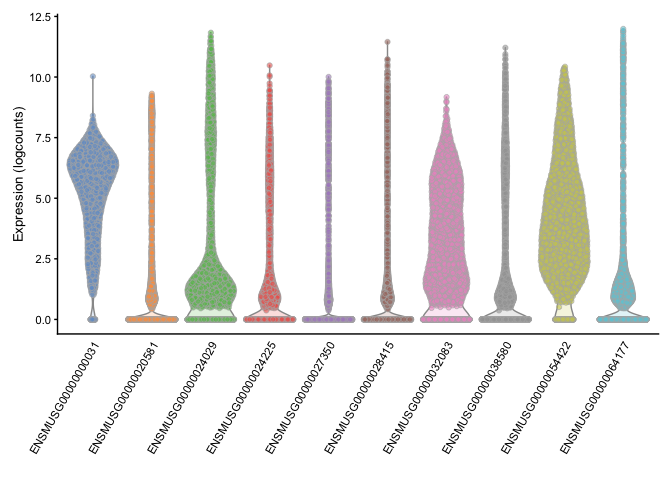

Normalization
================

Dependencies
------------

Load the major packages needed for this analysis first. Additional packages will be loaded as needed.

``` r
# dependencies needed
library(SingleCellExperiment)
library(scater)
library(scran)
library(uwot)
library(Rtsne)
```

Loading the filtered file which was output by "2\_QC\_Filtering.Rmd"

``` r
filtered <- readRDS(file="../processed_data/guiu_filtered.rds")
```

Removing composition bias by normalization
------------------------------------------

To perform normalization by deconvolution first we have to perform a quick clustering step.

``` r
library(scran)
set.seed(100)
clust.guiu <- quickCluster(filtered) # first do quick clustering 
table(clust.guiu) # how many clusters and how many cells in each
```

    ## clust.guiu
    ##   1   2   3   4   5   6   7   8   9  10  11  12  13  14 
    ## 512 239 454 204 111 483 170 227 269 261 326 158 197 124

Next, size (sum) factors are estimated from pooled counts and then "deconvolved" to obtain value for each cell.

``` r
filtered <- computeSumFactors(filtered, cluster=clust.guiu)
summary(sizeFactors(filtered))
```

    ##    Min. 1st Qu.  Median    Mean 3rd Qu.    Max. 
    ## 0.05936 0.60625 0.98541 1.00000 1.33262 4.48955

Using the above calculated size factors, compute the normalized expression values for each cell. Log-transform the normalized expression values for downstream analysis

``` r
filtered <- logNormCounts(filtered)
assays(filtered) # now there are two assays the counts & the log normalized counts just made
```

    ## List of length 2
    ## names(2): counts logcounts

Modeling the variance and selection of highly variable genes (HVGs)
-------------------------------------------------------------------

Compute variance of the logcounts for each gene across all cells and then rank the output based on proportion of variance that is biological rather than technical.

``` r
set.seed(101)
filtered.var <- modelGeneVar(filtered)
filtered.var <- filtered.var[order(filtered.var$bio, decreasing=TRUE),]
head(filtered.var)
```

    ## DataFrame with 6 rows and 6 columns
    ##                                mean            total              tech
    ##                           <numeric>        <numeric>         <numeric>
    ## ENSMUSG00000024029 2.47185546039459 9.29499534901034 0.905687324468986
    ## ENSMUSG00000038580 1.77125702741572 6.99022137301686 0.917080592700791
    ## ENSMUSG00000054422 4.05487756857596  5.6829851622541 0.649325907512146
    ## ENSMUSG00000024225 1.66231391279607 5.87879953488568 0.907506985027947
    ## ENSMUSG00000028415 1.18079013826555 5.45090215448822 0.811558405320339
    ## ENSMUSG00000032083  3.0396635894297 5.10466527086393   0.8454719365915
    ##                                 bio               p.value                   FDR
    ##                           <numeric>             <numeric>             <numeric>
    ## ENSMUSG00000024029 8.38930802454136                     0                     0
    ## ENSMUSG00000038580 6.07314078031607                     0                     0
    ## ENSMUSG00000054422 5.03365925474195                     0                     0
    ## ENSMUSG00000024225 4.97129254985773  1.2402879186816e-224 3.73471363780342e-221
    ## ENSMUSG00000028415 4.63934374916788  2.0557204863706e-244 7.42814040545152e-241
    ## ENSMUSG00000032083 4.25919333427243 2.42220340962959e-190 4.37619490017779e-187

Select the most highly variable genes either by strict 10% proportion or by a 1% FDR threshold. See how many genes are retained by each metric.

``` r
top.genes.var <- getTopHVGs(filtered.var, prop=0.1) # keeps the top 10% as HGVs
length(top.genes.var) 
```

    ## [1] 1055

``` r
top.genes.varFDR <- getTopHVGs(filtered.var, fdr.threshold = 0.01) 
length(top.genes.varFDR) 
```

    ## [1] 1292

Plot log normalized expression of genes with the largest biological component to their variance

``` r
plotExpression(filtered, features=top.genes.varFDR[1:10])
```



Save out the resulting files

``` r
saveRDS(filtered, file="../processed_data/guiu_filtered_normalized.rds") # save the sce post norm
saveRDS(top.genes.varFDR, file="../processed_data/top.genes.varFDR.rds") 
saveRDS(filtered.var, file="../processed_data/filtered.var.rds") 
```

``` r
sessionInfo()
```

    ## R version 3.6.2 (2019-12-12)
    ## Platform: x86_64-apple-darwin15.6.0 (64-bit)
    ## Running under: macOS Sierra 10.12.6
    ## 
    ## Matrix products: default
    ## BLAS:   /Library/Frameworks/R.framework/Versions/3.6/Resources/lib/libRblas.0.dylib
    ## LAPACK: /Library/Frameworks/R.framework/Versions/3.6/Resources/lib/libRlapack.dylib
    ## 
    ## locale:
    ## [1] en_US.UTF-8/en_US.UTF-8/en_US.UTF-8/C/en_US.UTF-8/en_US.UTF-8
    ## 
    ## attached base packages:
    ## [1] parallel  stats4    stats     graphics  grDevices utils     datasets 
    ## [8] methods   base     
    ## 
    ## other attached packages:
    ##  [1] Rtsne_0.15                  uwot_0.1.5                 
    ##  [3] Matrix_1.2-18               scran_1.14.5               
    ##  [5] scater_1.14.6               ggplot2_3.2.1              
    ##  [7] SingleCellExperiment_1.8.0  SummarizedExperiment_1.16.1
    ##  [9] DelayedArray_0.12.2         BiocParallel_1.20.1        
    ## [11] matrixStats_0.55.0          Biobase_2.46.0             
    ## [13] GenomicRanges_1.38.0        GenomeInfoDb_1.22.0        
    ## [15] IRanges_2.20.2              S4Vectors_0.24.2           
    ## [17] BiocGenerics_0.32.0        
    ## 
    ## loaded via a namespace (and not attached):
    ##  [1] locfit_1.5-9.1           Rcpp_1.0.3               rsvd_1.0.2              
    ##  [4] lattice_0.20-38          assertthat_0.2.1         digest_0.6.23           
    ##  [7] R6_2.4.1                 evaluate_0.14            pillar_1.4.3            
    ## [10] zlibbioc_1.32.0          rlang_0.4.2              lazyeval_0.2.2          
    ## [13] irlba_2.3.3              rmarkdown_2.0            labeling_0.3            
    ## [16] BiocNeighbors_1.4.1      statmod_1.4.33           stringr_1.4.0           
    ## [19] igraph_1.2.4.2           RCurl_1.95-4.12          munsell_0.5.0           
    ## [22] compiler_3.6.2           vipor_0.4.5              BiocSingular_1.2.1      
    ## [25] xfun_0.12                pkgconfig_2.0.3          ggbeeswarm_0.6.0        
    ## [28] htmltools_0.4.0          tidyselect_0.2.5         tibble_2.1.3            
    ## [31] gridExtra_2.3            GenomeInfoDbData_1.2.2   edgeR_3.28.0            
    ## [34] viridisLite_0.3.0        crayon_1.3.4             dplyr_0.8.3             
    ## [37] withr_2.1.2              bitops_1.0-6             grid_3.6.2              
    ## [40] gtable_0.3.0             lifecycle_0.1.0          magrittr_1.5            
    ## [43] scales_1.1.0             dqrng_0.2.1              RcppParallel_4.4.4      
    ## [46] stringi_1.4.5            farver_2.0.1             XVector_0.26.0          
    ## [49] viridis_0.5.1            limma_3.42.0             DelayedMatrixStats_1.8.0
    ## [52] cowplot_1.0.0            tools_3.6.2              glue_1.3.1              
    ## [55] beeswarm_0.2.3           purrr_0.3.3              yaml_2.2.0              
    ## [58] colorspace_1.4-1         knitr_1.26
