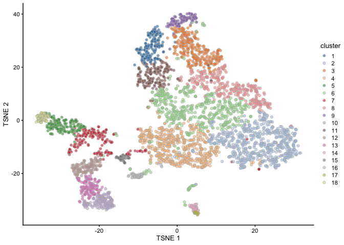
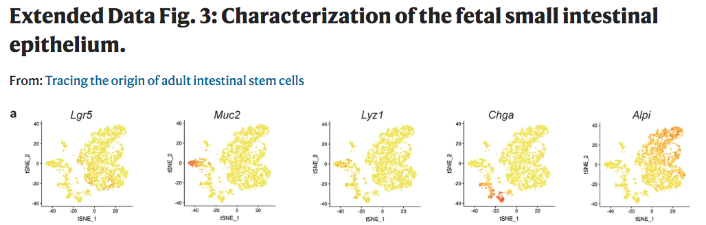
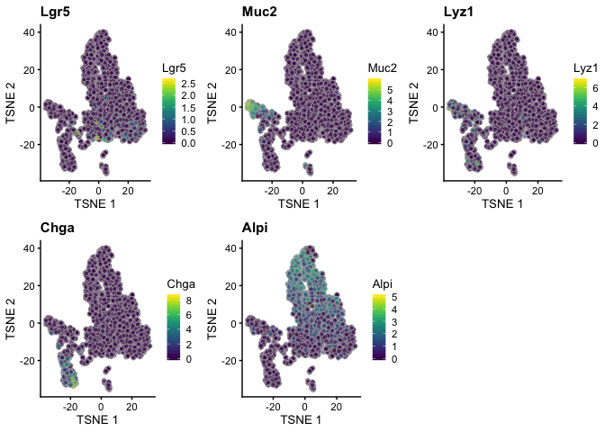
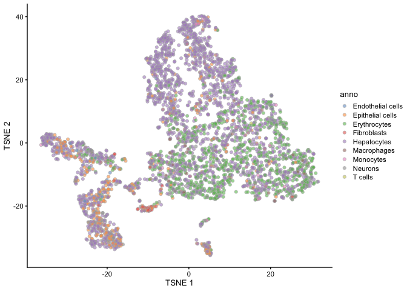

Dimensionality Reduction and Plotting
================

Dependencies
------------

Load the major packages needed for this analysis first. Additional packages will be loaded as needed.

``` r
# dependencies needed
library(SingleCellExperiment)
library(scater)
library(scran)
library(uwot)
library(Rtsne)
```

Loading the unfiltered file which was output by "3\_Normalization.Rmd"

``` r
filtered<-readRDS( file="../processed_data/guiu_filtered_normalized.rds")
filtered.var<-readRDS(file="../processed_data/filtered.var.rds")
top.genes.varFDR<-readRDS( file="../processed_data/top.genes.varFDR.rds") 
```

Dimensionality Reduction by PCA and tSNE
----------------------------------------

``` r
# perform PCA for dimension reduction with 
set.seed(101)
filtered.denoised <- denoisePCA(filtered, 
                                subset.row=top.genes.varFDR, 
                                technical=filtered.var)
# convert rownames to gene symbol
rownames(filtered.denoised)<-rowData(filtered.denoised)$Symbol

# perform tSNE for further dimension reduction
set.seed(102)
filtered.denoised <- runTSNE(filtered.denoised, dimred="PCA")
```

Clustering
----------

``` r
g <- buildSNNGraph(filtered.denoised, k=10, use.dimred = 'PCA')
clust <- igraph::cluster_walktrap(g)$membership
table(clust)
```

    ## clust
    ##   1   2   3   4   5   6   7   8   9  10  11  12  13  14  15  16  17  18 
    ## 182 641 305 531 162 546 184 305 105 141 180 122 122  41  42  42  22  62

``` r
filtered.denoised$cluster <- factor(clust)
plotReducedDim(filtered.denoised, dimred="TSNE", colour_by="cluster")
```



Examining expression of marker genes across the population
----------------------------------------------------------



``` r
diffMarkers<-c("Lgr5", "Muc2", "Lyz1", "Chga", "Alpi")

gridExtra::grid.arrange(
  plotReducedDim(filtered.denoised, dimred="TSNE", colour_by=diffMarkers[1]) +
    ggtitle(diffMarkers[1]),
  plotReducedDim(filtered.denoised, dimred="TSNE", colour_by=diffMarkers[2]) +
    ggtitle(diffMarkers[2]),
  plotReducedDim(filtered.denoised, dimred="TSNE", colour_by=diffMarkers[3]) +
    ggtitle(diffMarkers[3]),
  plotReducedDim(filtered.denoised, dimred="TSNE", colour_by= diffMarkers[4]) +
    ggtitle(diffMarkers[4]),
  plotReducedDim(filtered.denoised, dimred="TSNE", colour_by= diffMarkers[5]) +
    ggtitle(diffMarkers[5]),
  ncol=3
)
```



``` r
library(SingleR)
ref <- MouseRNAseqData()    
```

    ## snapshotDate(): 2019-10-22

    ## see ?SingleR and browseVignettes('SingleR') for documentation

    ## loading from cache

    ## see ?SingleR and browseVignettes('SingleR') for documentation

    ## loading from cache

``` r
pred <- SingleR(test=filtered.denoised, ref=ref, labels=ref$label.main)
table(pred$labels)
```

    ## 
    ## Endothelial cells  Epithelial cells      Erythrocytes       Fibroblasts 
    ##                23               374               919                41 
    ##       Hepatocytes       Macrophages         Monocytes           Neurons 
    ##              2154                64                36               122 
    ##           T cells 
    ##                 2

``` r
filtered.denoised2<-filtered.denoised
filtered.denoised2$anno <- factor(pred$labels)
plotReducedDim(filtered.denoised2, dimred="TSNE", colour_by="anno")
```



Save the resulting files

``` r
saveRDS(filtered.denoised, file="../processed_data/guiu_filtered_denoised.rds") 
saveRDS(filtered.denoised2, file="../processed_data/guiu_filtered_denoised2.rds") 
```

``` r
sessionInfo()
```

    ## R version 3.6.2 (2019-12-12)
    ## Platform: x86_64-apple-darwin15.6.0 (64-bit)
    ## Running under: macOS Sierra 10.12.6
    ## 
    ## Matrix products: default
    ## BLAS:   /Library/Frameworks/R.framework/Versions/3.6/Resources/lib/libRblas.0.dylib
    ## LAPACK: /Library/Frameworks/R.framework/Versions/3.6/Resources/lib/libRlapack.dylib
    ## 
    ## locale:
    ## [1] en_US.UTF-8/en_US.UTF-8/en_US.UTF-8/C/en_US.UTF-8/en_US.UTF-8
    ## 
    ## attached base packages:
    ## [1] parallel  stats4    stats     graphics  grDevices utils     datasets 
    ## [8] methods   base     
    ## 
    ## other attached packages:
    ##  [1] SingleR_1.0.5               Rtsne_0.15                 
    ##  [3] uwot_0.1.5                  Matrix_1.2-18              
    ##  [5] scran_1.14.5                scater_1.14.6              
    ##  [7] ggplot2_3.2.1               SingleCellExperiment_1.8.0 
    ##  [9] SummarizedExperiment_1.16.1 DelayedArray_0.12.2        
    ## [11] BiocParallel_1.20.1         matrixStats_0.55.0         
    ## [13] Biobase_2.46.0              GenomicRanges_1.38.0       
    ## [15] GenomeInfoDb_1.22.0         IRanges_2.20.2             
    ## [17] S4Vectors_0.24.2            BiocGenerics_0.32.0        
    ## 
    ## loaded via a namespace (and not attached):
    ##  [1] bitops_1.0-6                  bit64_0.9-7                  
    ##  [3] httr_1.4.1                    tools_3.6.2                  
    ##  [5] backports_1.1.5               R6_2.4.1                     
    ##  [7] irlba_2.3.3                   vipor_0.4.5                  
    ##  [9] DBI_1.1.0                     lazyeval_0.2.2               
    ## [11] colorspace_1.4-1              withr_2.1.2                  
    ## [13] tidyselect_0.2.5              gridExtra_2.3                
    ## [15] curl_4.3                      bit_1.1-14                   
    ## [17] compiler_3.6.2                BiocNeighbors_1.4.1          
    ## [19] labeling_0.3                  scales_1.1.0                 
    ## [21] rappdirs_0.3.1                stringr_1.4.0                
    ## [23] digest_0.6.23                 rmarkdown_2.0                
    ## [25] XVector_0.26.0                pkgconfig_2.0.3              
    ## [27] htmltools_0.4.0               fastmap_1.0.1                
    ## [29] dbplyr_1.4.2                  limma_3.42.0                 
    ## [31] rlang_0.4.2                   RSQLite_2.2.0                
    ## [33] shiny_1.4.0                   DelayedMatrixStats_1.8.0     
    ## [35] farver_2.0.1                  dplyr_0.8.3                  
    ## [37] RCurl_1.95-4.12               magrittr_1.5                 
    ## [39] BiocSingular_1.2.1            GenomeInfoDbData_1.2.2       
    ## [41] Rcpp_1.0.3                    ggbeeswarm_0.6.0             
    ## [43] munsell_0.5.0                 viridis_0.5.1                
    ## [45] lifecycle_0.1.0               stringi_1.4.5                
    ## [47] yaml_2.2.0                    edgeR_3.28.0                 
    ## [49] zlibbioc_1.32.0               BiocFileCache_1.10.2         
    ## [51] AnnotationHub_2.18.0          grid_3.6.2                   
    ## [53] blob_1.2.0                    promises_1.1.0               
    ## [55] dqrng_0.2.1                   ExperimentHub_1.12.0         
    ## [57] crayon_1.3.4                  lattice_0.20-38              
    ## [59] cowplot_1.0.0                 locfit_1.5-9.1               
    ## [61] zeallot_0.1.0                 knitr_1.26                   
    ## [63] pillar_1.4.3                  igraph_1.2.4.2               
    ## [65] glue_1.3.1                    BiocVersion_3.10.1           
    ## [67] evaluate_0.14                 BiocManager_1.30.10          
    ## [69] RcppParallel_4.4.4            httpuv_1.5.2                 
    ## [71] vctrs_0.2.1                   gtable_0.3.0                 
    ## [73] purrr_0.3.3                   assertthat_0.2.1             
    ## [75] xfun_0.12                     mime_0.8                     
    ## [77] rsvd_1.0.2                    xtable_1.8-4                 
    ## [79] later_1.0.0                   viridisLite_0.3.0            
    ## [81] tibble_2.1.3                  AnnotationDbi_1.48.0         
    ## [83] beeswarm_0.2.3                memoise_1.1.0                
    ## [85] statmod_1.4.33                interactiveDisplayBase_1.24.0
